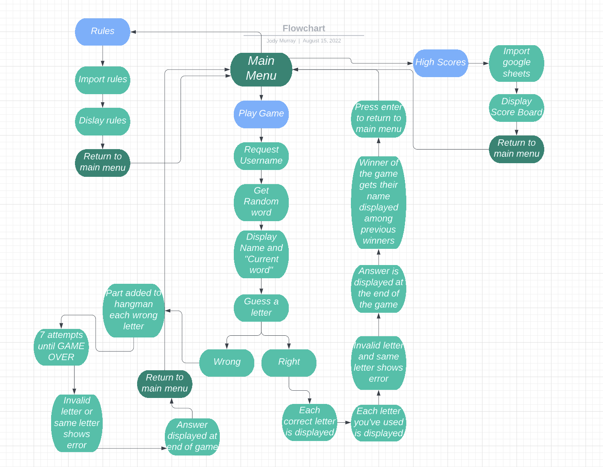
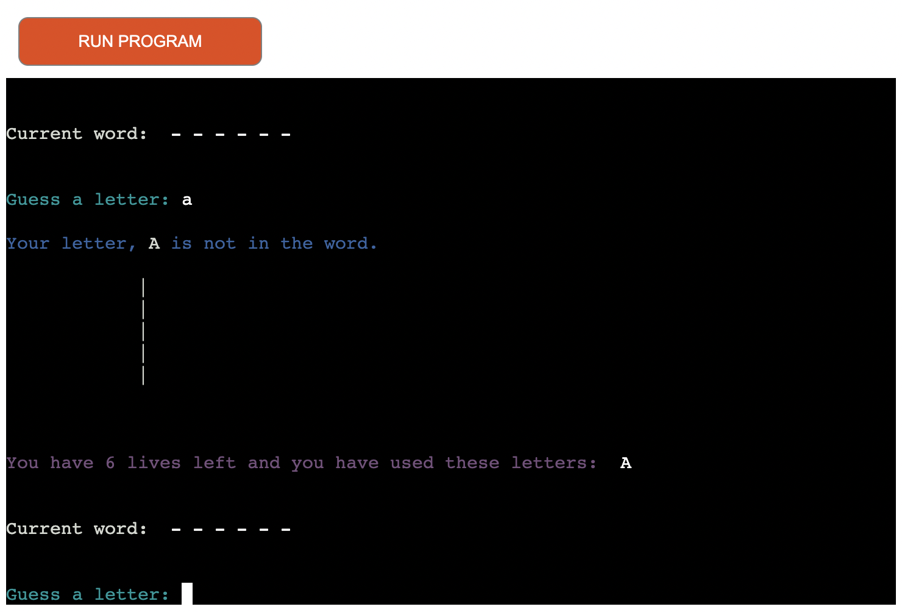
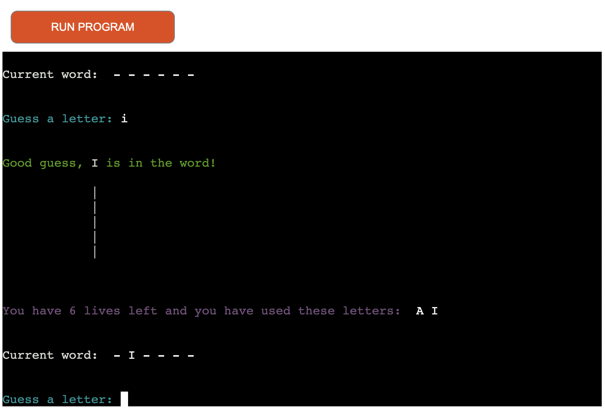
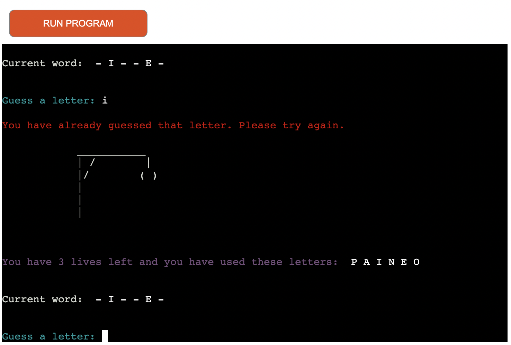

**Hangman**

This game is based from the original Hangman game we all grew up with. A random word is selected and you're given the number of letters it contains. Guessing a new letter each go, if you choose correct, the terminal will tell you and show you where it belongs in the randonly chosen word, if you guess wrong, a line will be added to the "hangman" until it is complete.

The words used are on a separate page and are chosen randomly from many, many words. The game only gives you 7 lives, which is the amount of wrong answers to complete the "hangman" image. 

This project is the third of five projects that needs to be completed in order to receve a diploma in Software Development from The Code Institute.

A live version of this website will be found here: https://hangman-game00.herokuapp.com/

## Table of Contents ##

UX

- [User Demographic](#user-demographic "User Demographic")
- [User Goals](#user-goals "User Goals")
- [Design](#design "Design")
- [Colour Scheme](#colour-scheme "Colour Scheme")

Features

- [Application Features](#application_features "Application Features")
- [Main Menu Landing Page](#main_menu_landing_page "Main Menu Landing Page")
- [Word Page](#word_page "Word Page")
- [Rules Page](#rules_page "Rules Page")
- [High Scores](#high_scores "High Scores")
- [User Error](#user_error "User Error")

Technologies Used

- [Languages Used](#languages_used "Languages Used")
- [Python Libraries and API](#python_libraries_and_api "Python Libraries and API")
- [Storing Data](#storing_data "Storing Data")

Testing

  - [Validator testing](#validator-testing "Validator Testing")
  - [Testing and bugs](#testing-and-bugs "Testing and bugs")

Deployment

  - [Deployment](#deployment "Deployment")

Acknowledgements

- [Acknowledgements](#acknowledgements "Acknowledgements")

Sources

- [Sources](#sources "Sources")

------------------------------------------------------------------------------------------------------------

## UX 

## User Demographic
 This application has been designed for users of all ages just for some fun, to test their knowledge and see if they are any good at the class game, Hangman!
 
 ## User Goals
 * To have some fun and play Hangman!
 * To have users test their knowledge.
 * To pass the time.

 ## Design 
The design has been inspired by a tutorial demonstration I came across: https://www.youtube.com/watch?v=8ext9G7xspg&t=2111s

The aim for this website is to create a user friendly terminal based application, that also retrieves and displays current and new data. The landing page provides a menu selection: Play Game, See Rules, See Highscores, or Exit application.

## Colour Scheme
- The colours I imported using termcolor. 
- It allows basic colours to be used in the terminal.
- I used colours in a nice order throughout the game that is appealing to the eyes.

## Features

- Application Features
- Main Menu Landing Page
- Game
- Rules
- High Scores
- User Error

# Application Features

- The application consists of features such as; Username input, a random choice from a long list of words, a scoreboard record of who has won the game.

# Main Menu Loading Page

- The user is firstly presented with a menu page, showing the options for the game.

# Game

- When you select 1: in the main menu, the game will start. First, the user will get a request for a name, which will be added to the Winner's board if they win at the end of the game. 

- Current word selected and displayed as "-------".

- Each wrong answer and a part gets added to the figure.

- Every correct letter is displayed, as are the letters the user has used and the letter placement in the word itself.

- At the end of the game the user will see whether they've won or lost, either way the user can see the whole word displayed.

# Rules

### The rules option in the main menu will bring the user to the Rules list page.

# High Scores

### The HighScores option in the main menu will bring the user to the winner's board, a list of names of people who have won the game.

# User Error 

### The application is also able to catch user error and request appropriate data. The use of red text also helps to visually indicate to the user that an error has also occurred.

# Technologies Used 

* [Python](https://www.python.org/)
* [HTML](https://html.com/) - Included in the Code Institute template
* [CSS](https://en.wikipedia.org/wiki/CSS) - Included in the Code Institute template
* [JavaScript](https://www.javascript.com/) - Included in the Code Institute template

# Python libraries and API

* [Re](https://docs.python.org/3/library/re.html)
* [Sys](https://docs.python.org/3/library/sys.html)
* [Termcolor](https://pypi.org/project/termcolor/)
* [Gspread](https://docs.gspread.org/en/latest/)
* [Google Auth](https://google-auth.readthedocs.io/en/master/)
* [Random](https://docs.python.org/3/library/random.html)
* [String](https://docs.python.org/3/library/string.html)

# Storing data

* [Google Sheets](https://www.google.com/sheets/about/)
* [Google Drive](https://www.google.com/drive/)

# Testing

Testing and checking application functionality has been carried out continuously over the development of the project.

# Validator Testing

Code has been tested and corrected via the PEP8 Online Validator http://pep8online.com/.

# Fixed bugs

### - Colouring text was an issue with many arguments in a perameter.
- Research from stackoverflow helped.

### - Attempts to create a function to select level for game didn't work for me.
- Left this out as it was taking me too long.

### - Getting high score list was showing up for both winners and losers.
- Moved line of code to just have high scores showing and adding your name if you win.

### - Import code was coming up as an issue.
- Reorganising structure resolved this issue.

### - Name request was coming up twice, at the beginning of the game and the end.
- Moving the code to the correct function resolved this issue.

### - Square brackets in the HighScores section.
- Left this issue.

### - Lines were over the 79 character limit.
- Went through all the corresponding lines of code and ammended them.

### Lots of trailing white spaces were detected.
- Went through the corresponding lines of code and rectified the white spacing.

# Deployment

The development environment used for this project was Gitpod. Regular commits and pushes to Github have been employed to be able to track and trace the development process of the website. The Gitpod environment for this particular project was created using a template provided by Code Institute.

The live version of this project is deployed using [Heroku](https://heroku.com).

The following is the procedure for how this project was deployed via Heroku:

A requirements.txt needs to be created in the same folder as the .py file in Gitpod. This needs to have a list of necessary libraries the project needs to run as a Heroku.

* Log in to Heroku (or create an account if otherwise)
* Click on New in the Heroku dashboard and select ”Create new app”
* Give the application an original name, choose your region and click “Create App”
* In the settings tab for the new application two Config Vars are necessary:
    * One is named CREDS and contains the credentials key for Google Drive API
    * One is name PORT and has the value of 8000
* Two buildpack scripts were added: Python and Nodejs (in that order)
* Go to "Deploy" section, and click the Github icon in 'Deployment Method' and connect
* In this case, this project was set to 'Automatic Deploys'.
* Deployment should then be completed within a brief time span and link readily available. 

After those steps were taken the application was deployed at the following link: **

# Acknowledgements

For inspiration, for code, design help and advice, I'd like to thank;

### Martina Terlevic
- My wonderful mentor at Code Institute.

### The Code Institute
- For support and education.

### Keiron Chaudhry
- Fellow student and colleague.

# Sources

Various websites have been consulted during the development of this project. All code has been credited in code comments within the project.

The following have proved incredibly helpful:

- https://stackoverflow.com/
- https://www.youtube.com/ - coding course channel
- Slack

